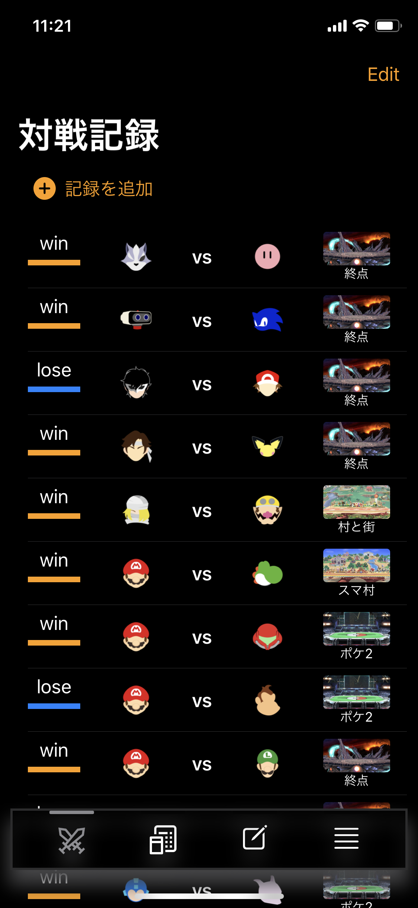
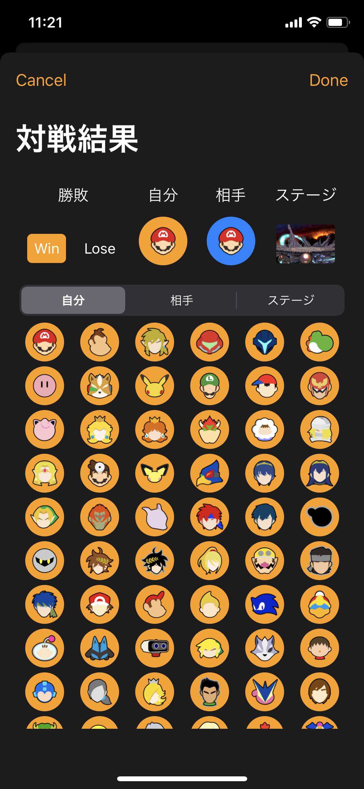
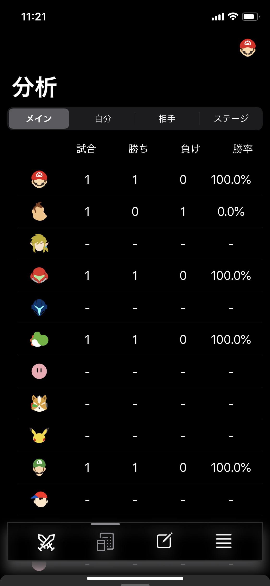
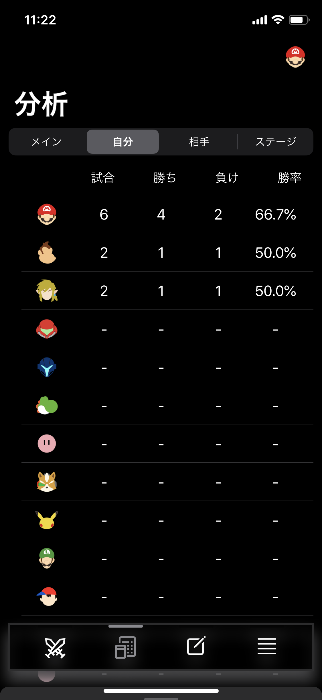
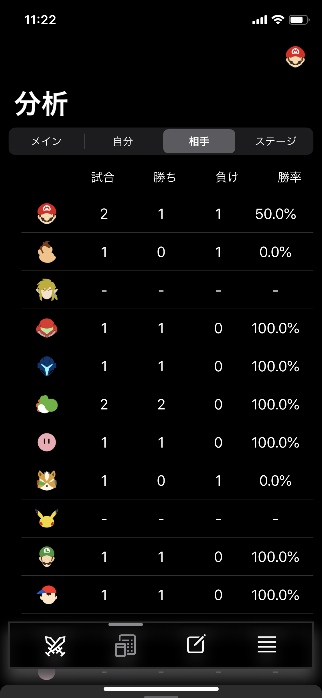
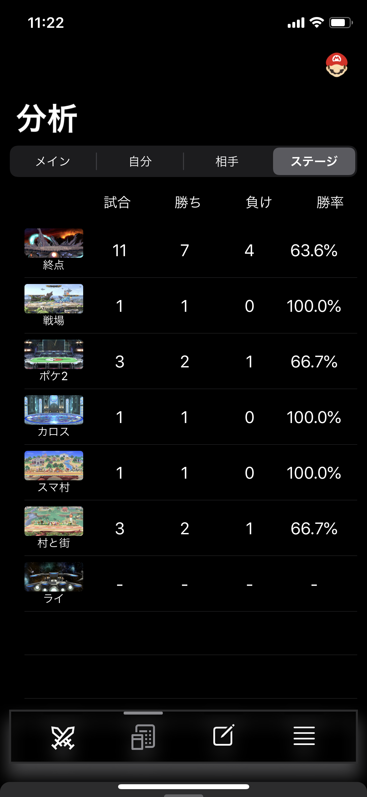
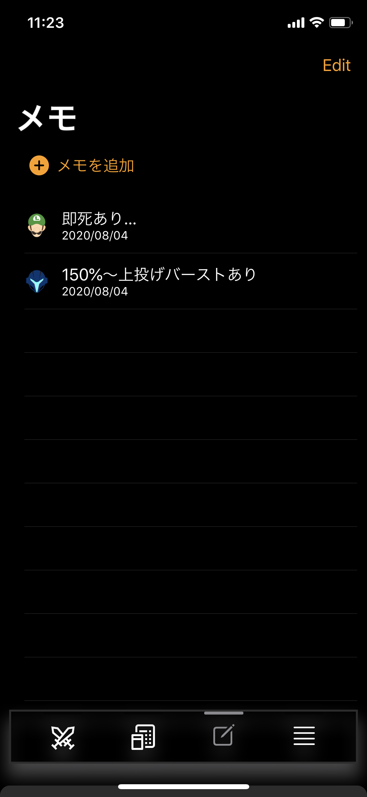
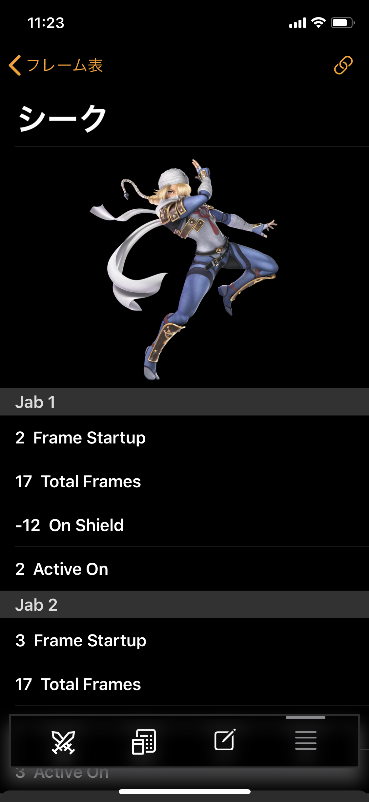
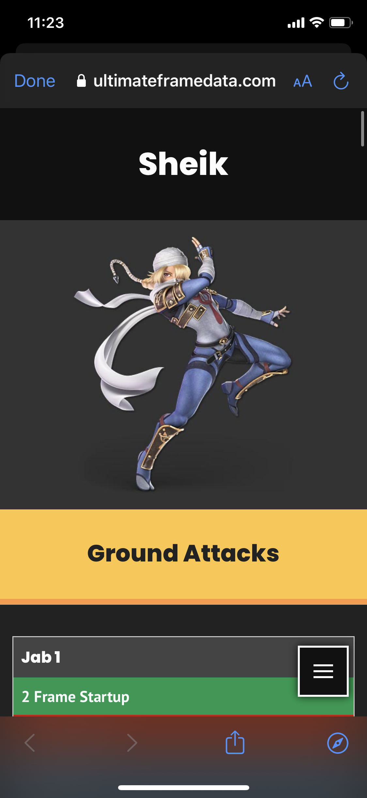

# Smash

# 紹介
スマブラ用のアプリです。
MVVMを意識しました。
また、PythonでWebスクレイピングにも挑戦してみました。

# 機能
- 対戦結果の記録、削除
- 対戦結果の分析（メインキャラ、自分のキャラクター、相手のキャラクター、ステージ）
- キャラクター対策メモ
- キャラクターごとのフレーム表の確認
- 重量、空中加速、空中移動、落下、ダッシュ、歩行、走行それぞれのランキングを確認

# 開発環境
- 開発言語 : Swift  
- フレームワーク : SwiftUI  
- 設計 : MVVM + Combine  
- データベース : Firebase(Cloud FireStore), UserDefaults
- ユーザー認証 : 匿名認証
- パッケージ管理 : Cocoapods  
- バージョン管理 : Git  
- スクレイピング : Python, Beautiful Soup, Requests, Pandas

# オープンソースライブラリ
- Firebase/Analytic
- Firebase/Firestore
- Firebase/Auth
- FirebaseFirestoreSwift
- IQKeyboardManagerSwift（keyboardの上げ下げ、閉じ）
- WaterfallGrid（データの並び）  

